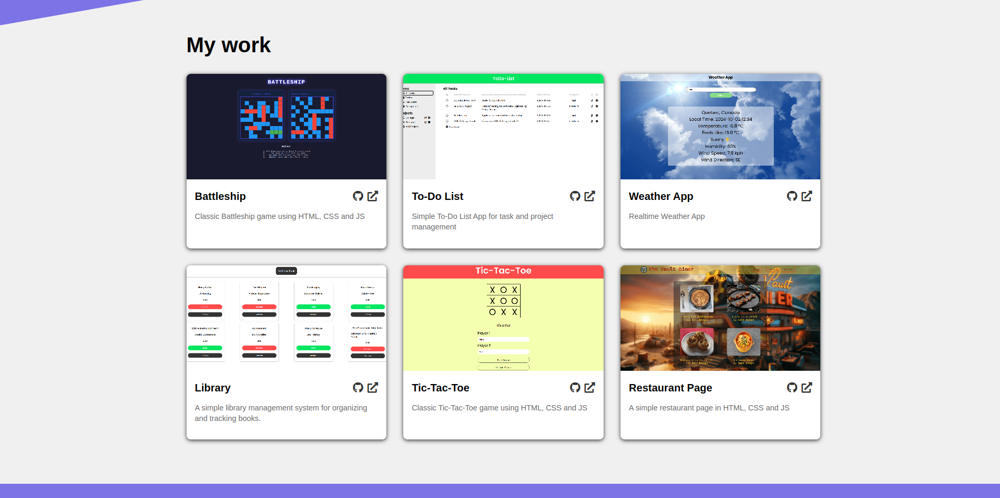
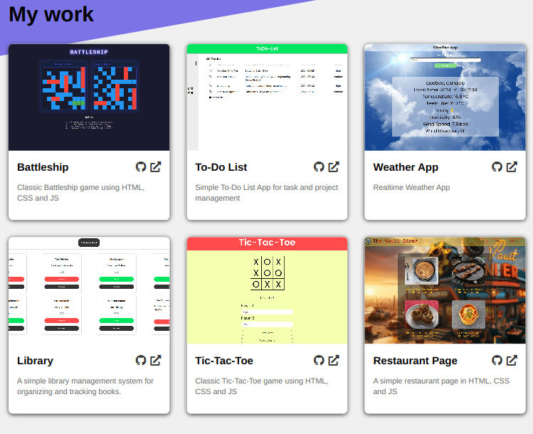
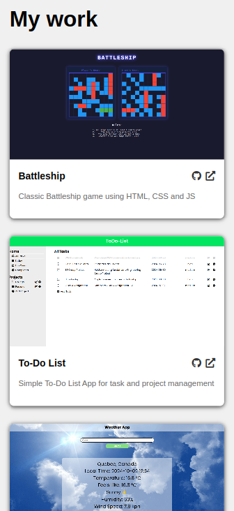

# Homepage

This project is a responsive personal portfolio website showcasing my work and skills. It's built using HTML, CSS, and JavaScript, with a focus on clean design and user experience across various devices.

## Features

- Responsive design for mobile, tablet, and desktop
- About me section with social media links
- Project showcase with links to live demos and GitHub repositories
- Contact information section
- Smooth scrolling and interactive elements

## Requirements

- HTML5
- CSS3 (with Flexbox and Grid)
- JavaScript
- Webpack for asset management and bundling
- Font Awesome for icons

## Setup and Installation

1. Clone the repository
2. Install dependencies:
   ```
   npm install
   ```
3. Run the development server:
   ```
   npm run start
   ```
4. Build for production:
   ```
   npm run build
   ```

## Customization

To customize this portfolio for your own use:

1. Replace the profile image in the `src/img` directory
2. Update the personal information and project details in `src/index.html`
3. Modify colors and styles in `src/style.css` to match your preferences
4. Add your own project screenshots to the `src/img` directory and update the image sources in `src/index.html`

## Deployment

After building the project, deploy the contents of the `dist` folder to your preferred hosting platform.

## Preview

### Desktop



### Tablet



### Mobile


